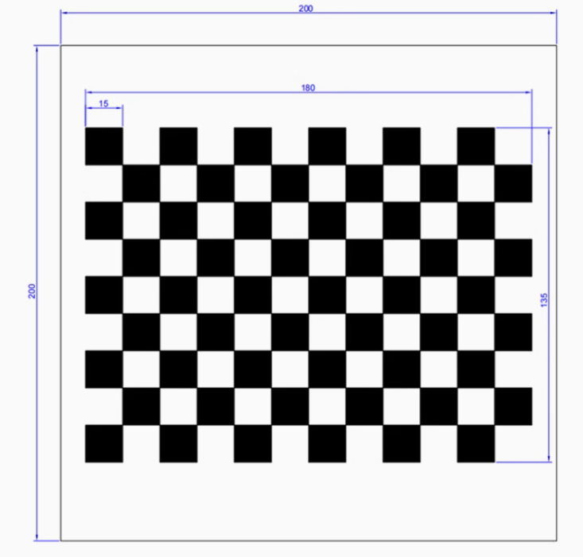

# intrinsic calibration camera

Checkerboard images can be used to calibrate the camera. The calibration process estimates the intrinsic parameters of the camera, such as focal length, principal point, and lens distortion coefficients.

The image is below:




## Matlab

```
cameraCalibrator
```

install webcam for Matlab then use the live to capture images from the camera. Then you can use those photos to do the calibration. Finally, you can save the camera parameters and estimate error for the camera.

As the files show below:

cameraParams.mat
estimateError.mat

## Python

Run the "save.py" script to capture images from the camera. The script will save the images in a specified directory. You can then use the "calculate.py" script to perform the calibration.

Attendtion the calibration pixel width and height
1. ir1_intrinsics.json: 1280x720
2. rgb_intrinsics.json: 1920x1080

When you use the calibration parameters, you should keep the pixel size in mind. If you want to change to another pixel width and height, you need redo the calibration in the "save.py" script and "calculate.py" script.

# optical maker tracking

## Video to demo the algorithm


# QR code detection

## Video to demo the algorithm


